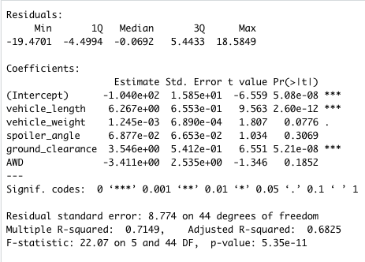
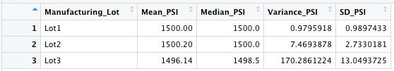
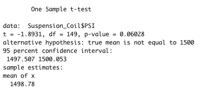
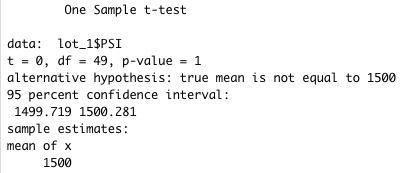
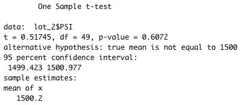
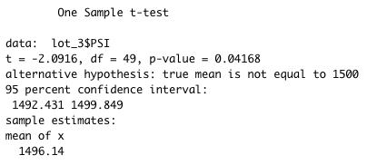

# MechaCar_Statistical_Analysis

## Linear Regression to Predict MPG

Which variables/coefficients provided a non-random amount of variance to the mpg values in the dataset?

The variables that provided a non-random amount of variance to the mpg values in the dataset were vehicle_weight, spoiler_angle, and AWD which had p-values of 0.0776, 0.3069, and 0.1852 respectively.  The most random amount of variance was in the vehicle_length and ground_clearance which had p-values of 2.60e-12 and 5.21e-08, respectively

Is the slope of the linear model considered to be zero? Why or why not?

The p-value of our linear regression analysis is 5.35e-11, which is much smaller than our assumed significance level of 0.05%. A low p-value (< 0.05) indicates that you can reject the null hypothesis. Therefore, we can state that there is sufficient evidence to reject our null hypothesis, which means that the slope of our linear model is not zero

Does this linear model predict mpg of MechaCar prototypes effectively? Why or why not?

Our R-squared value of 0.7149 (or 71%) measures the strength of the relationship between the model and the dependent variable on a from a 0 – 100% scale. Our calculated p-value and r-squared values combined determine that this model of predicting the mpg of MechaCar prototypes is effective.

Here is the summary statistics of the linear regression model:

## Suspension Coil Summary Statistics

The design specifications for the MechaCar suspension coils dictate that the variance of the suspension coils must not exceed 100 pounds per square inch. Does the current manufacturing data meet this design specification for all manufacturing lots in total and each lot individually? Why or why not?

Here is the total summary statistics:

The current manufacturing data for all manufacturing lots in total has a suspension coil variance_PSI of 62.29356. We can conclude that the suspension coils do not exceed the 100 pounds per square inch variance and therefore meet the design specification.

The current manufacturing data for lots 1,2, and 3 have suspension coil variance_PSIs of 0.97959718, 7.4693878, and 170.2861224, respectively. We can conclude the suspension coils of lots 1 and 2 do not exceed the 100 pounds per square inch variance and therefore meet the design specification. However, lot 3 has a variance 170.2861224 which is greater than the 100 pounds per square inch design specification. Lot 3 does not meet the design specification.

Here are the lot summary statistics:

## T-Tests on Suspension Coils

Based on our significance level of 0.05 percent, our p-value for the lots in total is below our significance level. Therefore, we have sufficient evidence to reject the null hypothesis, and we would state that the two means are not statistically similar.

total ttest statistics:

Based on our significance level of 0.05 percent, our p-value for lot 1 is below our significance level. Therefore, we have sufficient evidence to reject the null hypothesis, and we would state that the two means are not statistically similar.

lot 1 ttest statistics:

Based on our significance level of 0.05 percent, our p-value for lot 2  is below our significance level. Therefore, we have sufficient evidence to reject the null hypothesis, and we would state that the two means are not statistically similar.

lot 2 ttest statistics:

Based on our significance level of 0.05 percent, our p-value for lot 3 is below our significance level. Therefore, we have sufficient evidence to reject the null hypothesis, and we would state that the two means are not statistically similar.

lot 3 ttest statistics:

## Study Design: MechaCar vs Competition

What metric or metrics are you going to test?

Fuel efficiency is a form of thermal efficiency, meaning the ratio of effort to result of a process that converts chemical potential energy contained in a carrier (fuel) into kinetic energy or work. In today's economy, fuel efficiency is one of the key metrics of interest to a consumer. Fuel efficient cars reduce pollution and smog as well as save money on fuel costs. Let's see how MechCar's fuel efficiency compares to the competition.

What is the null hypothesis or alternative hypothesis?

The null hypothesis (Ho) is there is no statistical difference between MechaCar's fuel efficiency and its competitor's fuel efficiency. The alternative hypothesis (Ha) is there is a difference in fuel efficiency between MechaCar and the competition.

What statistical test would you use to test the hypothesis? And why?
What data is needed to run the statistical test?

We can perform A two-sample t-test to compare the MPGs of MechaCar and the competition. In addition to the overall mpg, we can breakdown the study even rather and compare city MPG and highway MPG. Testing these metrics will help us determine whether or not there is a statistical difference in the MPG distributions.
